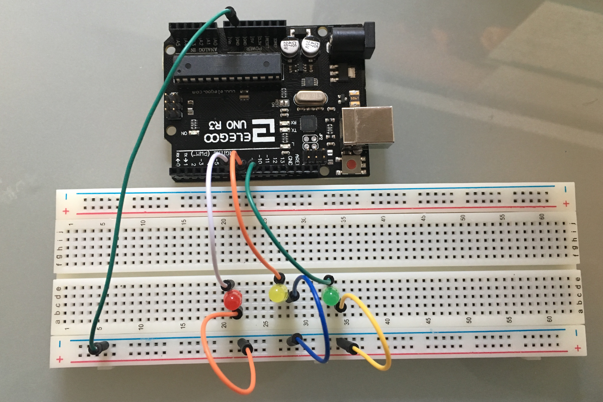

# Arduino
Arduino sketch files and associated circuit diagrams

##blinking_led_light
  Make a LED light blink every x miliseconds
  Circuit:
    
  
##traffic_light
  A traffic light sequence
  Circuit:
    
  
  
