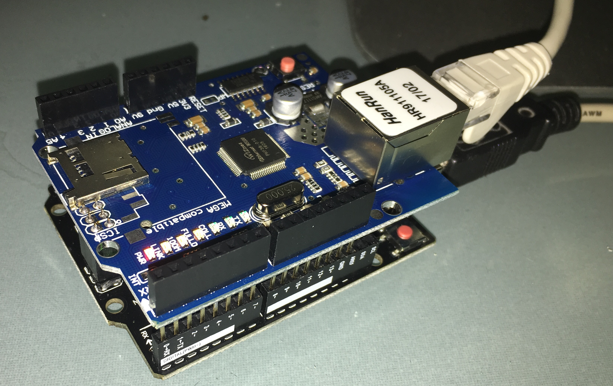
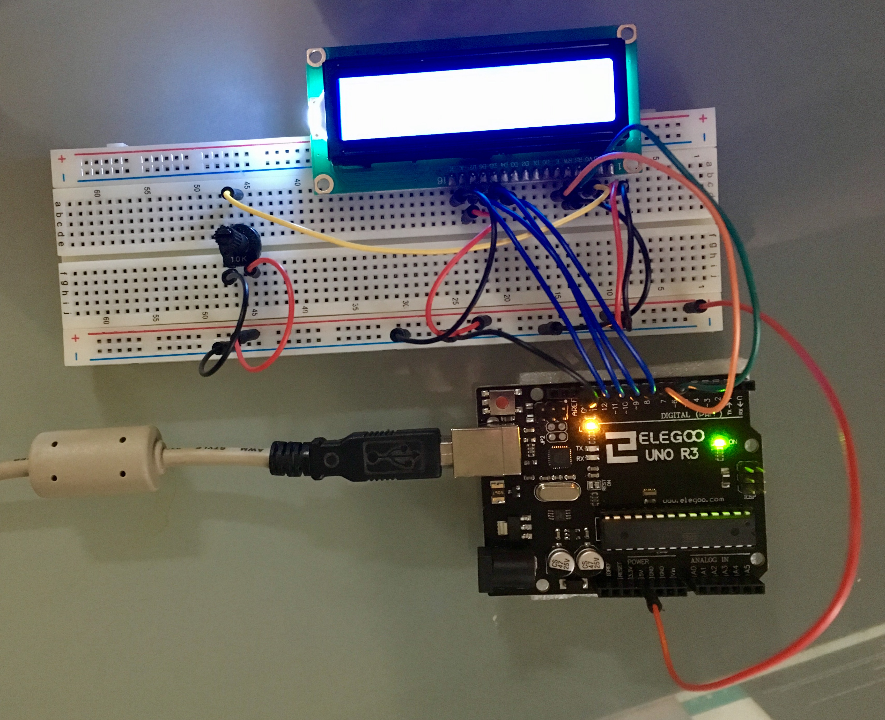

# Arduino Sketches
Arduino UNO examples with sketch files and circuit diagrams.

## Blinking LED Light
  Make a LED light blink every x miliseconds
  
  Circuit Picture:
    

  Notes:
  - Resistor: 220 Ohms
  
## Traffic Lights
  A traffic light sequence. User can enter "U" for UK and "O" for other country.
  
  Circuit Picture:
    
  
  Notes:
  - Each LED should be protected with an appropriate resistor (not shown here for simplicity)

## Ethernet Shield

Initialise ethernet connection and display IP address details obtained from DHCP

Circuit Picture:
  

Notes:
- Connect Uno Ethernet Shield (or equivalent) to Uno board. Take care when connecting shield not to bend pins and to ensure all Pins are connected correctly.
- Power on Uno board. Red power light will appear on Ethernet sheild
- Connect Ethernet cable (cable should be connected to a network with DHCP router/service)
- Upload ethernet.ino and connect a serial monitor
- Board will connect to Ethernet and display IP address (Note: getting an IP address can take some time)
- For full details see: https://www.arduino.cc/en/Reference/Ethernet 

## Using a LCD 

Sketch displays a string read from the serial port on first line of LCD (scrolling if necessary). On second line the number of seconds the program has been running for is displayed.

Circuit Picture:
  

Notes:

- Hardware: Uno, Uno compatible LCD, Breadboard, connector wires, 10K Potentiometer
- The Potentiometer is used to control the contrast of the LCD
- See Sketch comments for instructions on running program

## Temperature and Humidity 

Sketch displays the current tempeature and humidity on a LCD.

Button used to change temperature bto Farhaneit (F) (when pressed).

Circuit Picture:

Notes:
- Example uses a Adafruit compatible DHT11 sensor. For more information on DHT11 see: https://learn.adafruit.com/dht/overview 
- Builds on the "Using a LCD" sketch above