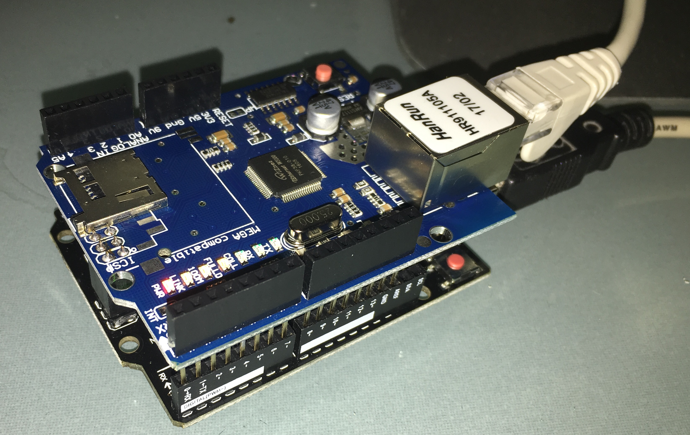

# Ethernet Shield

Initialise ethernet connection and display IP address details obtained from DHCP.

Circuit Picture:
  

Notes:
- Connect Uno Ethernet Shield (or equivalent) to Uno board. Take care when connecting shield not to bend pins and to ensure all Pins are connected correctly.
- Power on Uno board. Red power light will appear on Ethernet sheild
- Connect Ethernet cable (cable should be connected to a network with DHCP router/service)
- Upload ethernet.ino and connect a serial monitor
- Board will connect to Ethernet and display IP address (Note: getting an IP address can take some time)
- For full details see: https://www.arduino.cc/en/Reference/Ethernet