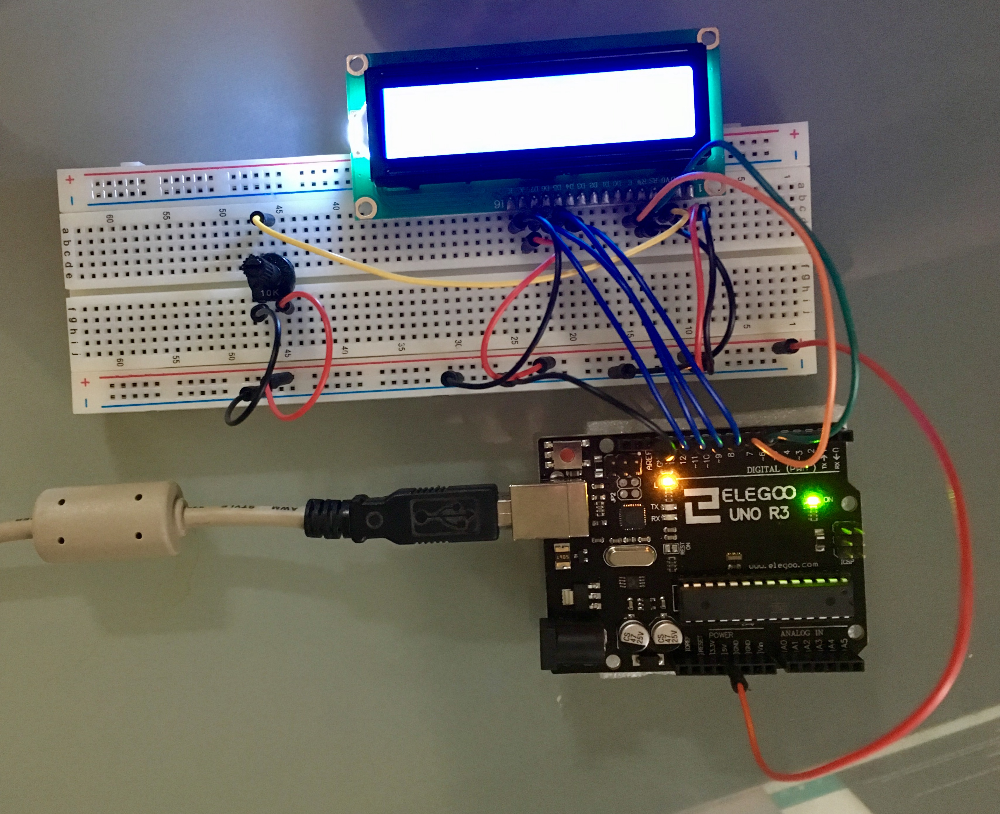

# Using a LCD  

Sketch displays a string read from the serial port on first line of LCD (scrolling if necessary). On second line the number of seconds the program has been running for is displayed.

Circuit Picture:
  

Notes:

- Hardware: Uno, Uno compatible LCD, Breadboard, connector wires, 10K Potentiometer
- The Potentiometer is used to control the contrast of the LCD
- See Sketch comments for instructions on running program