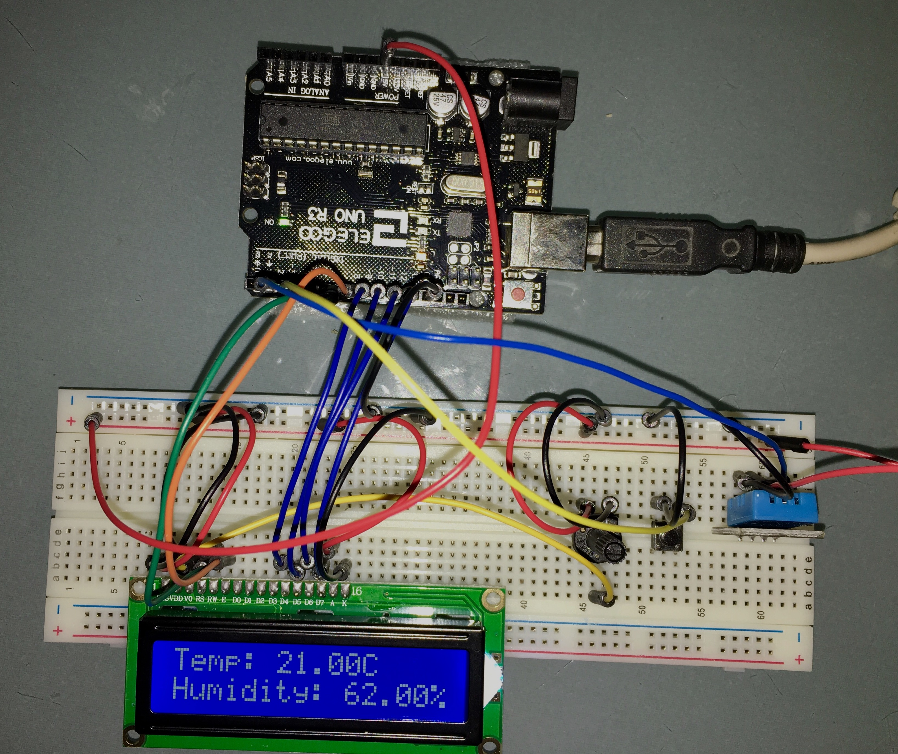

# Temperature and Humidity 

Sketch displays the current tempeature and humidity on a LCD.

Button used to change temperature to Farhaneit (F) (when pressed and held).

Circuit Picture:

Notes:
- Example uses a Adafruit compatible DHT11 sensor. For more information on DHT11 see: https://learn.adafruit.com/dht/overview 
- Builds on the "Using a LCD" sketch.