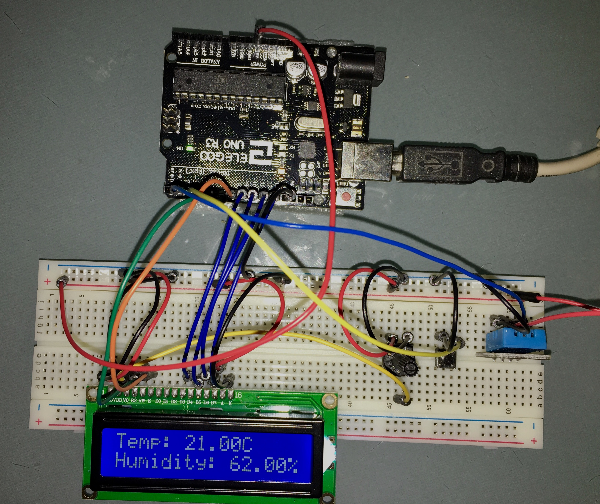

# Temperature and Humidity (Expanded)

Sketch displays the current tempeature and humidity on a LCD. Coloured LEDs are used to indicate acceptability of temperature.

- Red light: temp is too high
- Blue light: temp is too low
- Green light: temp is ok 

The _ok temperature range_ is harcoded (for now). In future will read from a web service.

Button used to change temperature to Farhaneit (F) (when pressed and held).

Circuit Picture:

Notes:
- Example uses a Hitachi compatible DHT22 sensor. For more information on DHT22 see: https://learn.adafruit.com/dht/overview 
- Builds on the "Using a LCD" sketch.